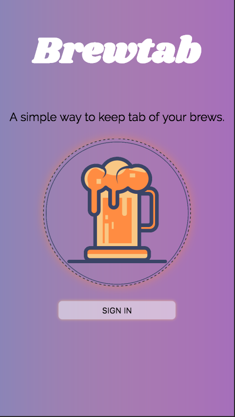

# Brewtab
 

 

##### I am building a beer journal application that is currently under construction. I am using React.js, HTML/SCSS and using tools like graph.cool to store beer data and Auth0 for authentication. I'm also dabbling with a few React UI libraries. 
##### * Sidenote: List of beers that are currently hardcoded for demo purposes are: Corona, Blue Moon, Shock top, Budweiser, and Floridian.
